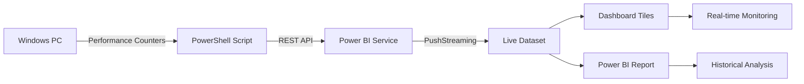
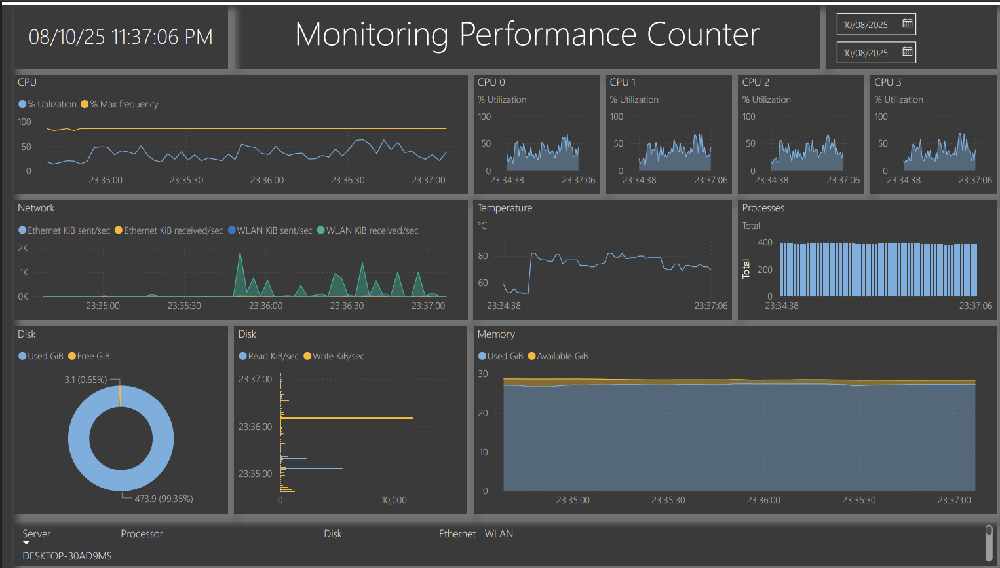

# 🚀 Power BI Real-time Performance Monitor Dashboard

<div align="center">


[](https://opensource.org/licenses/MIT)


[](https://github.com/VikramKavuri/power-bi-realtime-dashboard)

**Monitor Windows Performance Metrics in Real-time with Power BI - No Complex Infrastructure Required!**

[View Demo](https://app.powerbi.com/links/OdX0WyqgcH?ctid=4d3694c5-30db-415b-877c-bd2163526c94&pbi_source=linkShare) · [Report Issues](https://app.powerbi.com/links/OdX0WyqgcH?ctid=4d3694c5-30db-415b-877c-bd2163526c94&pbi_source=linkShare) · [Request Features](https://github.com/VikramKavuri/power-bi-realtime-dashboard/issues)


</div>

---

## 🎯 Overview

Transform your Windows performance monitoring with this **lightweight, real-time Power BI solution** that streams live system metrics directly to interactive dashboards - **no Event Hub or Stream Analytics required!** Perfect for IT operations, system administrators, and anyone needing instant visibility into system health.

### 💡 Why This Solution?

Traditional monitoring often requires complex infrastructure. This project delivers:
- **🚀 Instant Setup** - Running in minutes, not hours
- **💰 Zero Infrastructure Cost** - No Azure services needed
- **⚡ True Real-time** - Second-level updates
- **🎨 Beautiful Visualizations** - Professional Power BI dashboards
- **🔧 Fully Customizable** - Adapt to your specific needs

---

## ✨ Key Features

| Feature | Description |
|---------|-------------|
| **🖥️ Live System Monitoring** | Track CPU, Memory, Disk, Network, and Temperature in real-time |
| **📊 PushStreaming Technology** | Direct REST API integration - no intermediate services |
| **🔄 Automatic Data Collection** | PowerShell script continuously streams performance counters |
| **📱 Web-Accessible Dashboards** | Monitor from anywhere via Power BI Service |
| **🎯 Multi-Core CPU Tracking** | Individual core monitoring (0-3) plus total usage |
| **🌡️ Temperature Monitoring** | System temperature tracking for thermal management |
| **💾 Comprehensive Metrics** | 15+ performance indicators updated every second |
| **📈 Historical Trending** | Analyze patterns with included Power BI report (.pbix) |

---

## 🏗️ Architecture



### 🔍 How It Works

1. **Data Collection**: PowerShell reads Windows Performance Counters
2. **Data Transmission**: Script pushes data via Power BI REST API
3. **Data Storage**: PushStreaming dataset stores with FIFO retention
4. **Visualization**: Dashboard tiles update instantly as data arrives
5. **Analysis**: Power BI Desktop report provides deeper insights

---

## 📊 Monitored Metrics

<table>
<tr>
<td>

### 🖥️ **CPU Metrics**
- Total CPU Usage (%)
- Individual Core Usage (0-3)
- Max Frequency (%)

</td>
<td>

### 💾 **Memory Metrics**
- Available Memory (MB)
- Used Memory (MB)
- Memory Usage (%)

</td>
</tr>
<tr>
<td>

### 💿 **Disk Metrics**
- Free Space (Bytes)
- Disk Usage (%)
- Read/Write Speed (Bytes/sec)

</td>
<td>

### 🌐 **Network Metrics**
- Ethernet Bytes/sec
- WLAN Bytes/sec
- Total Network Traffic

</td>
</tr>
<tr>
<td colspan="2" align="center">

### 🌡️ **System Metrics**
- CPU Temperature (°C)
- Process Count
- Timestamp

</td>
</tr>
</table>

---

## 🚀 Quick Start Guide

### Prerequisites

- ✅ **Power BI Account** ([Sign up free](https://powerbi.microsoft.com))
- ✅ **Windows 10/11** or Windows Server
- ✅ **PowerShell 5.1+** (pre-installed on Windows)
- ✅ **Azure CLI** ([Download](https://docs.microsoft.com/en-us/cli/azure/install-azure-cli))
- ✅ **VS Code** with REST Client extension (or Postman/cURL)
- 📦 **Power BI Desktop** (optional, for report customization)

### 🔧 Installation Steps

#### Step 1: Clone the Repository
```powershell
git clone https://github.com/yourusername/power-bi-realtime-dashboard.git
cd power-bi-realtime-dashboard
```

#### Step 2: Authenticate & Get Access Token
```bash
# Login to Azure
az login

# Get Power BI access token
az account get-access-token --resource https://analysis.windows.net/powerbi/api
# Copy the accessToken value for later use
```

#### Step 3: Create PushStreaming Dataset

Using VS Code REST Client (or Postman):

```http
### Create Dataset
POST https://api.powerbi.com/v1.0/myorg/datasets?defaultRetentionPolicy=basicFifo
Authorization: Bearer YOUR_ACCESS_TOKEN
Content-Type: application/json

{
  "name": "Performance Counter",
  "defaultMode": "PushStreaming",
  "tables": []
}
```

Save the returned `id` (dataset GUID).

#### Step 4: Define Table Schema

```http
### Create Table
PUT https://api.powerbi.com/v1.0/myorg/datasets/YOUR_DATASET_ID/tables/RealtimeData
Authorization: Bearer YOUR_ACCESS_TOKEN
Content-Type: application/json

{
  "name": "RealtimeData",
  "columns": [
    {"name": "ComputerName", "dataType": "string"},
    {"name": "TimeStamp", "dataType": "DateTime"},
    {"name": "CounterDateTime", "dataType": "DateTime"},
    {"name": "CounterValue", "dataType": "Double"},
    {"name": "CounterPath", "dataType": "string"}
  ]
}
```

#### Step 5: Start Streaming Data

```powershell
# Navigate to scripts folder
cd src/ps

# Run the performance counter collector
.\Add-PerformanceCounter.ps1 `
    -DatasetId "YOUR_DATASET_ID" `
    -TableName "RealtimeData" `
    -Token "Bearer YOUR_ACCESS_TOKEN"
```

#### Step 6: Create Dashboard

1. Navigate to [Power BI Service](https://app.powerbi.com)
2. Go to your workspace
3. Create new Dashboard
4. Add Tile → Real-time Data → Your Dataset
5. Choose visualization type (Card, Gauge, Line chart)
6. Configure metrics and save

---

## 📁 Project Structure

```
power-bi-realtime-dashboard/
│
├── 📂 doc/
│   └── 📂 images/           # Screenshots and GIFs
│       ├── dashboard.png    # Dashboard preview
│       ├── source-settings.png
│       └── publish.gif
│
├── 📂 src/
│   ├── 📂 ps/              # PowerShell Scripts
│   │   └── Add-PerformanceCounter.ps1
│   │
│   └── 📂 pbi/             # Power BI Files
│       └── PerformanceCounter.pbix
│
├── 📂 api/                 # REST API Examples
│   ├── dataset-create.http
│   ├── table-schema.http
│   └── test-row.http
│
├── 📄 README.md
├── 📄 LICENSE
└── 📄 .gitignore
```

---

## 🎨 Dashboard Configuration

### Creating Streaming Tiles

<div align="center">
  
</div>

1. **Card Tiles**: Display current values (CPU %, Memory %)
2. **Gauge Tiles**: Show metrics against thresholds
3. **Line Charts**: Trend analysis over time
4. **KPI Tiles**: Track against targets

### Recommended Dashboard Layout

```
┌─────────────────────────────────────────────┐
│         System Performance Monitor          │
├──────────┬──────────┬──────────┬──────────┤
│   CPU    │  Memory  │   Disk   │ Network  │
│   75%    │   8.2GB  │   45%    │ 125KB/s  │
├──────────┴──────────┴──────────┴──────────┤
│          CPU Trend (Line Chart)            │
├─────────────────────────────────────────────┤
│         Memory Usage (Area Chart)          │
├──────────┬─────────────────────┬──────────┤
│   Temp   │   Process Count     │  Alerts  │
│   65°C   │        127          │    0     │
└──────────┴─────────────────────┴──────────┘
```

---

## 🛠️ Customization Guide

### Modifying Performance Counters

Edit `Add-PerformanceCounter.ps1` to add/remove counters:

```powershell
# Add custom counter
$counters += "\Memory\Cache Bytes"
$counters += "\PhysicalDisk(_Total)\Avg. Disk Queue Length"
```

### Adjusting Collection Interval

```powershell
# Change from 1 second to 5 seconds
Start-Sleep -Seconds 5
```

### Dynamic Network Adapter Detection

```powershell
# Auto-detect network adapters
$adapters = Get-NetAdapter | Where-Object {$_.Status -eq "Up"}
foreach ($adapter in $adapters) {
    $counters += "\Network Interface($($adapter.Name))\Bytes Total/sec"
}
```

---

## 🐛 Troubleshooting

| Issue | Solution |
|-------|----------|
| **No data appearing** | • Check dataset ID and table name<br>• Verify access token is valid<br>• Ensure counter names match system locale |
| **401/403 Errors** | • Token expired (refresh with `az account get-access-token`)<br>• Check Power BI permissions |
| **400 Bad Request** | • Verify JSON payload structure<br>• Check column names match schema exactly |
| **Network metrics blank** | • Update network adapter names in script<br>• Use `Get-Counter -ListSet "Network Interface"` to find correct names |
| **Locale issues** | • Install English language pack, or<br>• Modify counter paths to match local language |

---

## ⚡ Performance Optimization

### Dashboard Best Practices
- 📊 Limit to 10-15 tiles per dashboard
- ⏱️ Use streaming tiles for real-time, reports for historical
- 🎯 Avoid complex custom visuals for streaming data
- 📱 Design mobile layouts for on-the-go monitoring

### Data Management
- 🗄️ BasicFIFO policy auto-manages dataset size
- 📈 Archive historical data periodically if needed
- 🔄 Consider aggregation for long-term trends

---

## 🔒 Security Considerations

- 🔐 **Never commit tokens** to version control
- 🌐 **Use environment variables** for sensitive data
- 👥 **Limit sharing** - "Publish to web" makes data public
- 🏢 **Follow organizational** Power BI governance policies
- 🔑 **Rotate tokens** regularly for production use

---

## 💰 Cost Analysis

| Component | Free Tier | Pro/Premium |
|-----------|-----------|-------------|
| **Power BI Service** | ✅ Personal workspace | Organizational sharing |
| **Azure CLI** | ✅ Always free | N/A |
| **PowerShell** | ✅ Included with Windows | N/A |
| **Event Hub/Stream Analytics** | ❌ Not required! | Saves $$$ |

**Total Infrastructure Cost: $0** 🎉

---

## 🚦 Roadmap

- [ ] Auto-detect all network adapters dynamically
- [ ] Add predictive analytics with AI insights
- [ ] Mobile app with push notifications
- [ ] Multi-machine monitoring support
- [ ] Docker containerization option
- [ ] Integration with Teams/Slack alerts
- [ ] Custom alert thresholds
- [ ] Export to Excel/CSV functionality

---

## 🤝 Contributing

Contributions are welcome! Please feel free to submit a Pull Request.

1. Fork the repository
2. Create your feature branch (`git checkout -b feature/AmazingFeature`)
3. Commit your changes (`git commit -m 'Add some AmazingFeature'`)
4. Push to the branch (`git push origin feature/AmazingFeature`)
5. Open a Pull Request

---

## 📚 Resources

- 📖 [Power BI REST API Documentation](https://docs.microsoft.com/en-us/rest/api/power-bi/)
- 🎓 [Power BI Learning Path](https://docs.microsoft.com/en-us/learn/powerplatform/power-bi)
- 💻 [Windows Performance Counters](https://docs.microsoft.com/en-us/windows/win32/perfctrs/performance-counters-portal)
- 🔧 [PowerShell Documentation](https://docs.microsoft.com/en-us/powershell/)

---

## 📄 License

This project is licensed under the MIT License - see the [LICENSE](LICENSE) file for details.

---

## 👨‍💻 Author

<div align="center">

**VIKRAM KAVURI**

[](https://github.com/vikramkavuri)
[](https://www.linkedin.com/in/thrivikrama-rao-kavuri-7290b6147/)
[](https://my-portfolio-b2v0wnezh-vikram-kavuris-projects.vercel.app/)

📧 **Contact**: tkavuri@buffalo.edu.in

</div>

---

## 🙏 Acknowledgments

- Thanks to the Power BI community for continuous support
- Microsoft for providing excellent documentation
- All contributors who help improve this project
- Special thanks to the open-source community

---

<div align="center">

### ⭐ If you find this project useful, please consider giving it a star!

**Made with ❤️ by VIKRAM KAVURI**

*Transforming data into insights, one dashboard at a time* 🚀

</div>
